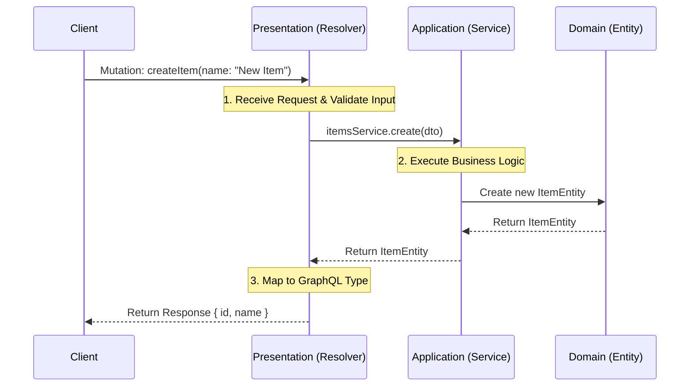

# Project Documentation: NestJS with GraphQL & Clean Architecture

## 1. Project Overview
This project is a boilerplate for a scalable backend application built with **NestJS** and **GraphQL**. It is structured using **Domain-Driven Design (DDD)** and **Clean Architecture** principles.

The main goal of this architecture is to separate the code into distinct layers, ensuring that the *business logic* is independent of the *framework*, *database*, or *user interface*.

## 2. Directory Structure & Naming Conventions
We use a modular approach where each feature (e.g., `items`) is a self-contained module.

```
src/
├── common/                  # Global shared code (utils, constants)
├── modules/                 # Feature modules (Business Features)
│   └── items/               # The 'Items' feature
│       ├── domain/          # 1. THE CORE: Entities & Business Rules
│       ├── application/     # 2. THE LOGIC: Use Cases (Services) & DTOs
│       ├── presentation/    # 3. THE INTERFACE: Controllers/Resolvers (GraphQL)
│       └── items.module.ts  # Wiring it all together
└── app.module.ts            # Root module
```

## 3. The Layers (Deep Dive)

### Layer 1: Domain (`src/modules/items/domain`)
**"The Heart of the Software"**
*   **What is it?**: This layer contains the pure business entities. It describes *what* your application deals with (e.g., an `Item`, a `User`, a `Payment`).
*   **Rules**: 
    *   It **must not** depend on any other layer. 
    *   It should be plain TypeScript classes.
    *   No external libraries (like TypeORM or GraphQL decorators) ideally, to keep it pure.
*   **Example**: `ItemEntity` class defines that an item has an `id`, `name`, and `description`.

### Layer 2: Application (`src/modules/items/application`)
**"The Brain / Orchestrator"**
*   **What is it?**: This layer handles the "use cases" of your application. It receives requests from the outside world (via the Presentation layer) and tells the Domain/Infrastructure what to do.
*   **Components**:
    *   **Services**: Contains methods like `createItem`, `findItem`. It contains the logic: "When I create an item, I need to validate X and save to Y."
    *   **DTOs (Data Transfer Objects)**: Simple objects defining the shape of data coming IN (e.g., `CreateItemInput`) and going OUT.
*   **Rules**: Depends only on the Domain layer.

### Layer 3: Presentation (`src/modules/items/presentation`)
**"The Doorway"**
*   **What is it?**: This layer represents how the outside world interacts with your application. In this project, it is **GraphQL**.
*   **Components**:
    *   **Resolvers**: These are the entry points. They listen for GraphQL Queries and Mutations.
    *   **Types**: The GraphQL schemas (ObjectTypes) that clients see.
*   **Rules**: Depends on the Application layer to do the actual work. It just invokes the service.

## 4. Data Flow (How a Request is Processed)
When a user sends a request to create an item, the data travels through the layers in a specific order.



### Step-by-Step Flow:
1.  **Request**: The Client sends a GraphQL mutation.
2.  **Presentation**: The `ItemsResolver` receives the input (`CreateItemInput`), validates it, and calls the `ItemsService`.
3.  **Application**: The `ItemsService` takes the input, creates a new `ItemEntity` (Domain object), adds it to the list (simulating a DB save), and returns it.
4.  **Response**: The `ItemsResolver` receives the entity and sends it back to the client as JSON.

## 5. Why use this structure?
1.  **Maintainability**: If you want to switch from GraphQL to REST, you only change the **Presentation** layer. Your business logic (Application/Domain) stays exactly the same.
2.  **Testing**: You can test the business logic (`ItemsService`) easily without needing to start a server or make HTTP requests.
3.  **Organization**: As the project grows to 100+ files, having strict folders prevents "spaghetti code" where everything is mixed together.
